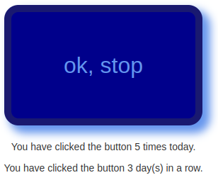

Hack-A-Day is a project I'm doing in November, where I try to make 30 new projects, in 30 days. I guess it's continuing past November, since I'm past day 30.

# Day 34: Hack-An-Uptime

Day 34 is a Uptime, a friendly competition to see who can stay in a game longest.

Demo available [here](https://tilde.za3k.com/hackaday/uptime).

Source available on [github](https://github.com/za3k/day34_uptime).
